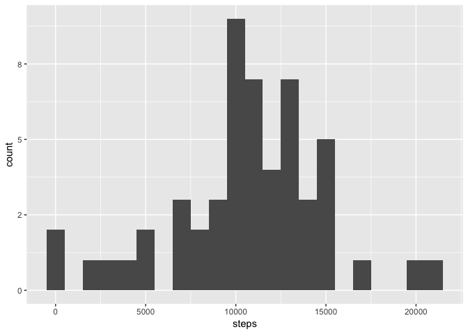
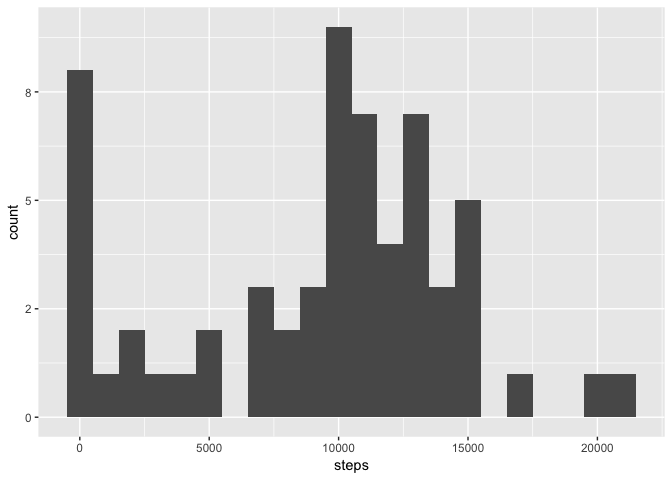
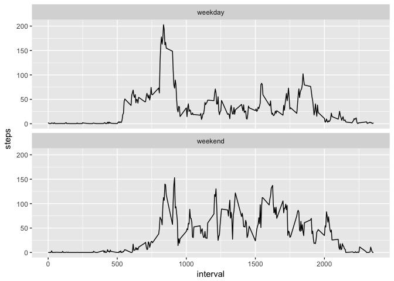

```r
library(tidyverse)
```

```
## ── Attaching packages ───────────────────────────────────────────────────────────── tidyverse 1.2.1 ──
```

```
## ✔ ggplot2 2.2.1.9000     ✔ purrr   0.2.4     
## ✔ tibble  1.3.4          ✔ dplyr   0.7.4     
## ✔ tidyr   0.7.2          ✔ stringr 1.2.0     
## ✔ readr   1.1.1          ✔ forcats 0.2.0
```

```
## ── Conflicts ──────────────────────────────────────────────────────────────── tidyverse_conflicts() ──
## ✖ dplyr::filter() masks stats::filter()
## ✖ dplyr::lag()    masks stats::lag()
```

```r
# Prevent scientific notation and display results with one significant digit
options(scipen = 999, digits=1)
```

## Loading and preprocessing the data


```r
data <- read_csv("activity.csv")
```

```
## Parsed with column specification:
## cols(
##   steps = col_integer(),
##   date = col_date(format = ""),
##   interval = col_integer()
## )
```

## What is mean total number of steps taken per day?


```r
total_steps_per_day <- data %>%
    group_by(date) %>%
    summarize(steps = sum(steps)) %>%
    na.omit()

ggplot(data = total_steps_per_day, aes(steps)) +
    geom_histogram(binwidth = 1000)
```

<!-- -->

The mean number of steps taken per day was:


```r
mean(total_steps_per_day$steps)
```

```
## [1] 10766
```

The median number of steps taken per day was: 

```r
median(total_steps_per_day$steps)
```

```
## [1] 10765
```

## What is the average daily activity pattern?


```r
average_steps_by_interval <- data %>%
    group_by(interval) %>%
    summarize(steps = mean(steps, na.rm = TRUE))

ggplot(data = average_steps_by_interval, aes(x = interval, y = steps)) +
    geom_line()
```

<!-- -->


```r
max_interval <- average_steps_by_interval %>%
    filter(steps == max(steps))
```

The 5-minute interval with the highest average number of steps was:


```r
max_interval$interval
```

```
## [1] 835
```

## Imputing missing values

The total number of rows with missing values in `data` is:


```r
data$steps %>% is.na %>% sum
```

```
## [1] 2304
```

We will impute missing values by substituting the median of each 5-minute interval. Do this using the awesome `simputation` package.


```r
library(simputation)

data_imputed <- data %>%
    impute_median(steps ~ interval)

total_steps_per_day_imputed <- data_imputed %>%
    group_by(date) %>%
    summarize(steps = sum(steps))

ggplot(data = total_steps_per_day_imputed, aes(steps)) +
    geom_histogram(binwidth = 1000)
```

<!-- -->

After using imputation, the mean number of steps taken per day was: 

```r
mean(total_steps_per_day_imputed$steps)
```

```
## [1] 9403
```

The median number of steps taken per day was:

```r
median(total_steps_per_day_imputed$steps)
```

```
## [1] 10395
```

Both of these values are lower than in the original data set.

## Are there differences in activity patterns between weekdays and weekends?


```r
data_imputed <- data_imputed %>%
    mutate(
        weekend = ifelse(weekdays(date) %in% c("Saturday", "Sunday"), 
                         "weekend", "weekday"),
        weekend = as.factor(weekend)
    )

average_steps_by_interval_weekend <- data_imputed %>%
    group_by(interval, weekend) %>%
    summarize(steps = mean(steps, na.rm = TRUE))

ggplot(data = average_steps_by_interval_weekend, aes(x = interval, y = steps)) +
    geom_line() +
    facet_wrap (~weekend, nrow = 2)
```

<!-- -->
